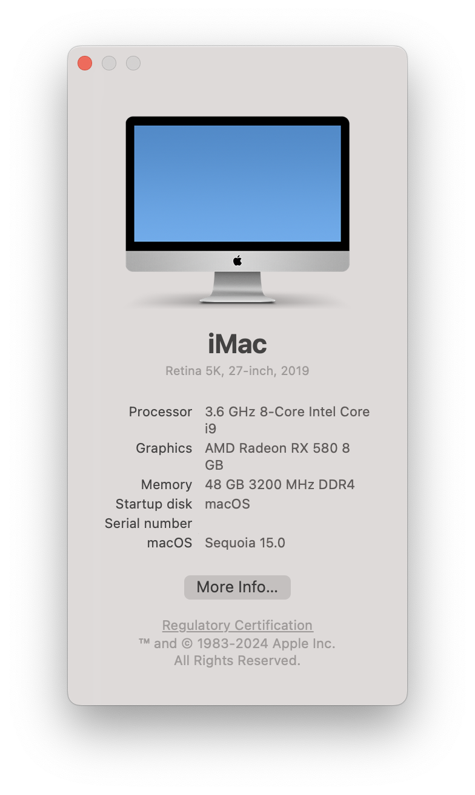

## macOS Sequoia (15.0)



## OpenCore & Kext

 | Name | Version |
 | ------ |---------|
 | OpenCore | 1.0.1   |
 | Lilu.kext | 1.6.9   |
 | VirtualSMC.kext | 1.3.4   |
 | WhateverGreen.kext | 1.6.8   |
 | SMCProcessor.kext | 1.3.4   | 
 | SMCSuperIO.kext | 1.3.4   | 
 | AppleALC.kext | 1.9.2   |
 | IntelMausi.kext | 1.0.8   | 
 | USBPorts.kext | 1.0     | 
 | IntelBluetoothFirmware.kext | 2.5.0 ❌ |
 | BlueToolFixup.kext | 2.6.8 ❌  |
 | AirportItlwm.kext | 2.3.0 ❌  | 


## 部分硬件信息：

```properties
CPU : INTEL i9-9900K
M/B : Asus ROG Strix Z390-E Gaming
Graphic : Intel UHD Graphics 630 / 蓝宝石RX580 8G白金版显卡
Memory : Corsair Vengeance RGB Black PRO 16GB (2 x 8GB + 2 x 16GB) DDR4 3200MHz
SSD : Western Digital WD BLACK SN750 NVMe M.2 2280 1TB
CASE : 九州风神 方舟SE电脑机箱
Power : CORSAIR RMx Series RM850x
Wireless Lan : Intel® Wireless-AC 9560
Bluetooth : Intel® Bluetooth® 5.0
Ethernet : Intel® I219V
Audio : ROG SupremeFX 8 声道 高清晰音频编码解码器S1220A
```

## USB 接口定制：


