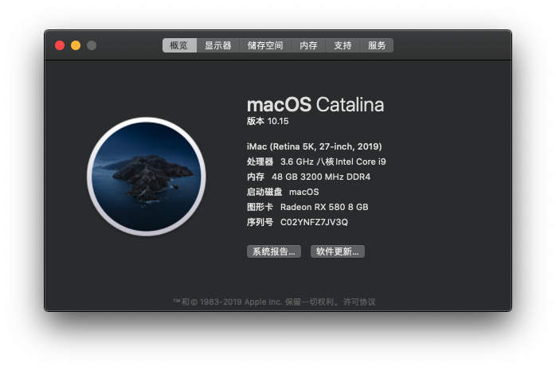

# hackintosh


## macOS Catalina 10.15 (19A602)




## 声卡驱动问题，注入声卡ID

```xml
			<key>PciRoot(0x0)/Pci(0x1f,0x3)</key>
			<dict>
				<key>layout-id</key>
				<data>
				AwAAAA==
				</data>
			</dict>
```


