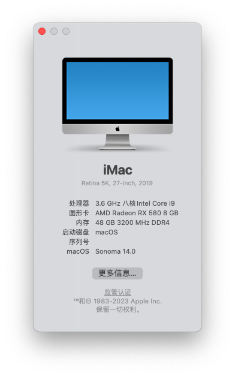
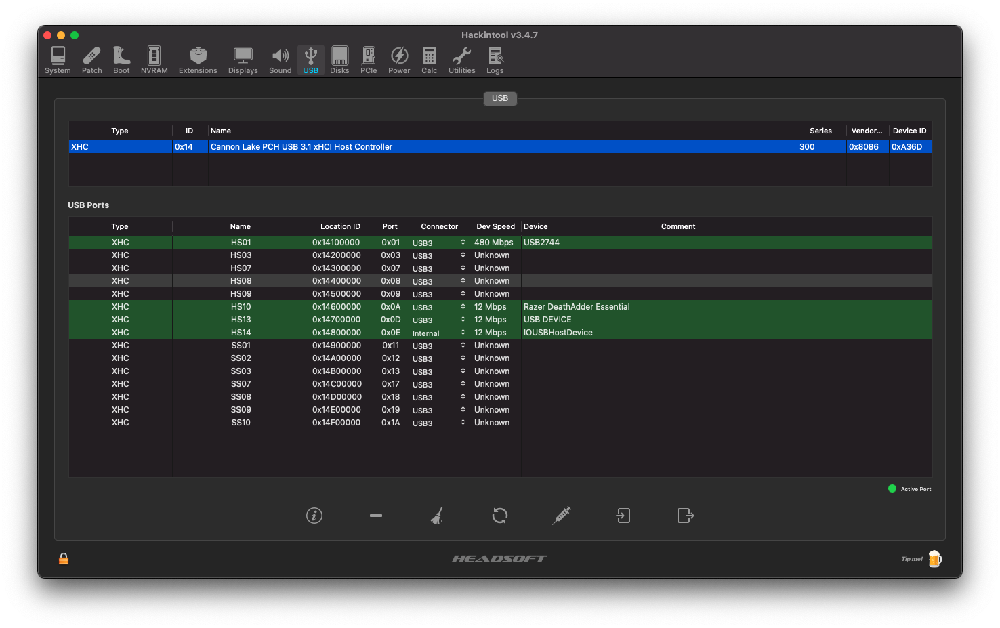

## macOS Sonoma 版本14.0



## OpenCore & Kext

`OpenCore-0.9.5`

 | Name | Version |
 | ------ |----- |
 | Lilu.kext | V1.6.7 |
 | VirtualSMC.kext | V1.3.2 |
 | WhateverGreen.kext | V1.6.6 |
 | SMCProcessor.kext | V1.3.2 | 
 | SMCSuperIO.kext | V1.3.2 | 
 | AppleALC.kext | V1.8.6 |
 | IntelMausi.kext | V1.0.7 | 
 | USBPorts.kext | V1.0 | 
 | IntelBluetoothFirmware.kext | V2.3.0 |
 | BlueToolFixup.kext | V2.6.8 |
 | AirportItlwm.kext | V2.3.0 | 


## 部分硬件信息：

```properties
CPU : INTEL i9-9900K
M/B : Asus ROG Strix Z390-E Gaming
Graphic : Intel UHD Graphics 630 / 蓝宝石RX580 8G白金版显卡
Memory : Corsair Vengeance RGB Black PRO 16GB (2 x 8GB + 2 x 16GB) DDR4 3200MHz
SSD : Western Digital WD BLACK SN750 NVMe M.2 2280 1TB
CASE : 九州风神 方舟SE电脑机箱
Power : CORSAIR RMx Series RM850x
Wireless Lan : Intel® Wireless-AC 9560
Bluetooth : Intel® Bluetooth® 5.0
Ethernet : Intel® I219V
Audio : ROG SupremeFX 8 声道 高清晰音频编码解码器S1220A
```

## USB 接口定制：




