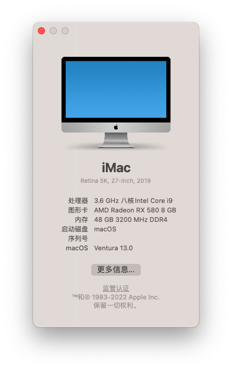

## macOS Monterey 版本12.0.1



注：板载英特尔蓝牙、无线可正常使用，系统启动缓慢未能解决。

## OpenCore

OpenCore-0.7.5

4D1FDA02-38C7-4A6A-9CC6-4BCCA8B30102:opencore-version	REL-075-2021-10-30


## 主机配置信息：

```
                                      xies mac iMac19,1
                                      ----------------------------------------------
                                      主板型号 :
                 ###                  操作系统 :  12.0.1 21A559
               ####                   内核版本 : Darwin 21.1.0
               ###                    开机时间 : 49 minutes
       #######    #######             Shell    : /bin/zsh
     ######################           当前时间 : 2021年10月31日 星期日 22时35分38秒
    #####################             处理器   : Intel Core i9-9900K 3.60GHz x (16)
    ####################              内存     : 3649MB(Avai) / 49152MB(Total)
    ####################              磁盘     : 142GB(Avai) / 466GB(Total)
    #####################             IP 地址  : 公网  / 内网 192.168.50.150
     ######################           当前终端 : xterm-256color by iTerm.app
      ####################            显卡设备 : Radeon RX 580 / VRAM (Total): 8 GB
        ################              主显示器 : 0 (1080p FHD - Full High Definition)
         ####     #####               扩展显示 : 0 (1080p FHD - Full High Definition)

```

## 部分硬件信息：

```properties
CPU : INTEL i9-9900K
M/B : Asus ROG Strix Z390-E Gaming
Graphic : Intel UHD Graphics 630 / 蓝宝石RX580 8G白金版显卡
Memory : Corsair Vengeance RGB Black PRO 16GB (2 x 8GB + 2 x 16GB) DDR4 3200MHz
SSD : Samsung 970 EVO 512GB
CASE : 九州风神 方舟SE电脑机箱
Power : CORSAIR RMx Series RM850x
Wireless Lan : Intel® Wireless-AC 9560
Bluetooth : Intel® Bluetooth® 5.0
Ethernet : Intel® I219V
Audio : ROG SupremeFX 8 声道 高清晰音频编码解码器S1220A
```

## USB 接口定制：


